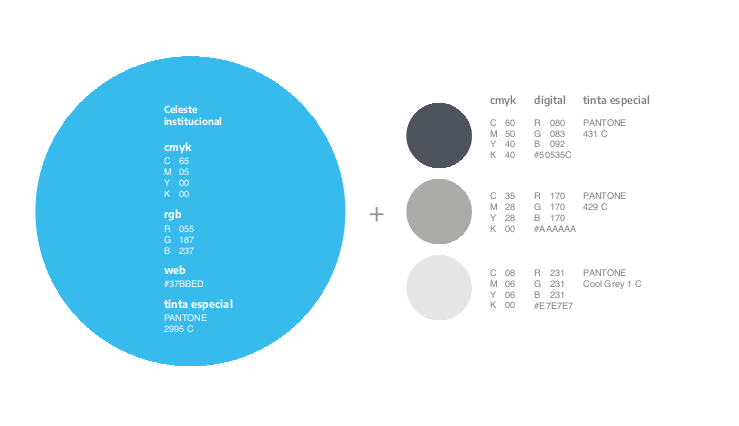
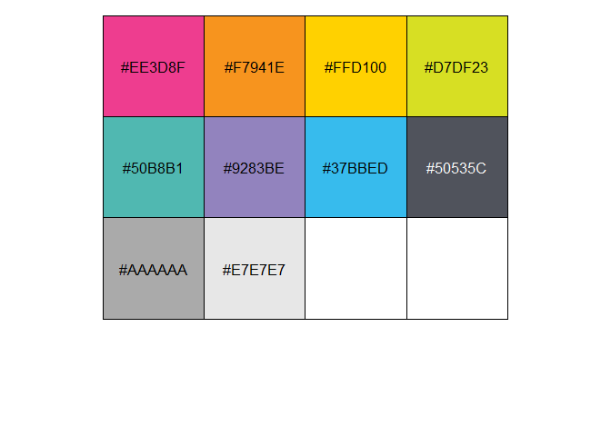

<!-- README.md is generated from README.Rmd. Please edit that file -->

# {comunicacion} <a href="https://dnme-minturdep.github.io/comunicacion/"></a>

<!-- badges: start -->
<!-- badges: end -->

`{comunicacion}` ofrece herramientas que facilitan la visualización de
datos en la [Dirección Nacional de Mercados y
Estadísticas](https://www.yvera.tur.ar/sinta/) del [Ministerio de
Turismo y Deportes de la
Nación](https://www.argentina.gob.ar/turismoydeportes).

## Instrucciones de instalación

Versión en desarrollo:

``` r
devtools::install_github("dnme-minturdep/comunicacion")
```

## Funciones

-   **`crear_informe()`**: Función para crear y abrir un template de
    informes para la DNMyE

-   **`dnmye_colores()`**: Funcion para extraer los colores
    institucionales de la dnmye como colores hex

-   **`dnmye_paletas()`**: Funcion para extraer paletas de colores
    colores institucionales de la dnmye como colores hex

-   **`scale_color_dnmye()`**: Constructor de escala de colores de
    contorno (argumento color) para la dnmye

-   **`scale_fill_dnmye()`**: Constructor de escala de colores de
    relleno (argumento fill) para la dnmye

-   **`rmdautotabs()`**: Permite generar automáticamente el código
    necesario para agrupar múltiples fragmentos de Rmarkdown en
    pestañas. Tomado de
    [`{sknifedatar}`](https://github.com/rafzamb/sknifedatar)

## Modo de uso

Estos son ejemplos básicos sobre cómo utilizar las funciones de la
librería:

``` r
library(comunicacion)

# Obtengo la paleta completa
comunicacion::dnmye_colores()
#>  [1] "#EE3D8F" "#F7941E" "#FFD100" "#D7DF23" "#50B8B1" "#9283BE" "#37BBED"
#>  [8] "#50535C" "#AAAAAA" "#E7E7E7"

# El código HEX para un color específico 
comunicacion::dnmye_colores("azul verde")
#> [1] "#50B8B1"
```

#### Colores institucionales

Paletas de colores primarios y secundarios del manual de estilo de
Presidencia la Nación.

<a></a>

<a></a>

``` r
# Explorar paleta de colores institucionales

scales::show_col(dnmye_colores())
```



## Cómo contribuir con el proyecto

Para colaborar en este proyecto, se recomienda hacer un Fork, trabajar
sobre ese repositorio y, antes de hacer el pull request, correr el
`devtools::check()` para garantizar que no haya conflictos.
