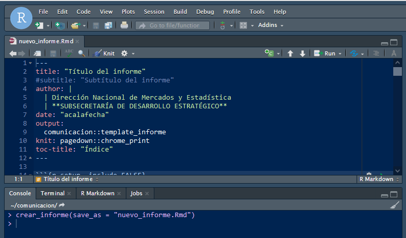

# Crear Informe

## `{r, include = FALSE} # knitr::opts_chunk$set( # collapse = TRUE, # comment = "#>" # ) #`

## `{r setup} # library(comunicacion) #`

La función
[`crear_informe()`](https://dnme-minturdep.github.io/comunicacion/reference/crear_informe.md)
genera un template con todos los estilos y elementos de comunicación
institucional pre definidos para la producción de un nuevo documento.
Entre sus parametros se puede definir un nombre y ruta de guardado
`save_as` , opciones para abrir en el editor (por defecto `TRUE`).

En el apartado`YAML` del encabezado se pueden setear el título que se
imprimirá en la portada, modificar el autor del documento (acá ya
definido por defecto) y ajsutar la fecha de publicación del mismo.
Luego, *knitear* y el paquete
[comunicacion](https://github.com/dnme-minturdep/comunicacion) se
encarga de la magia.  
  

